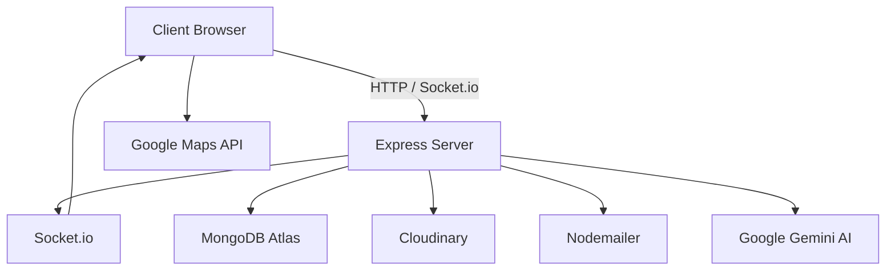

# 🏠 PropertyBazzar

[](LICENSE)
[](https://reactjs.org/)
[](https://nodejs.org/)
[](https://www.mongodb.com/atlas)
[](https://tailwindcss.com/)
[](https://socket.io/)
[](https://vitejs.dev/)
[](https://www.i18next.com/)

> **India's most trusted real estate platform** – secure, transparent, and verified property transactions.
>
> ## ✨ Features

- 🔐 **Authentication & Security**  
  Email/Password registration with OTP verification, JWT protection, admin verification

- 🏘️ **Property Management**  
  Multi‑step listing form (Aadhaar, Registration, Khata, Khasra), multi‑image upload (Cloudinary), AI‑generated descriptions (Gemini), advanced search & filters

- 💬 **Real‑time Chat**  
  Buyer‑Seller chat with Socket.io, typing indicators, message notifications

- ⭐ **Social & Engagement**  
  Favorites/Wishlist (heart toggle), star ratings & reviews, social sharing (WhatsApp, Facebook, Twitter)

- 📊 **Admin Dashboard**  
  Interactive analytics (Recharts), property verification with PDF reports, email notifications, activity log

- 🌙 **UI / UX**  
  Dark/Light mode toggle, fully responsive design, Tailwind CSS + Framer Motion animations, NLP‑powered support chatbot

- 🌐 **Multi‑language**  
  English & Hindi (react‑i18next) with language switcher

- 🗺️ **Maps Integration**  
  Google Maps with automatic address geocoding

- 📧 **Email Notifications**  
  OTP emails, approval/rejection with PDF attachments

- 💳 **Payments (Ready)**  
  Razorpay integration (test mode) for booking amounts


  ## 🛠️ Tech Stack & Dependencies

| Layer | Package | Version | Purpose |
|-------|---------|---------|---------|
| **Frontend** | `react` | 18.2 | UI library |
| | `react-dom` | 18.2 | DOM rendering |
| | `vite` | 5.0 | Build tool |
| | `tailwindcss` | 3.4 | Utility CSS |
| | `@tailwindcss/vite` | 4.0 | Tailwind Vite plugin |
| | `framer-motion` | 11.0 | Animations |
| | `react-router-dom` | 6.22 | Routing |
| | `axios` | 1.6 | HTTP client |
| | `react-icons` | 5.0 | Icons (Fa, etc.) |
| | `recharts` | 2.12 | Charts |
| | `react-i18next` | 14.0 | Internationalization |
| | `i18next` | 23.7 | i18n core |
| | `i18next-browser-languagedetector` | 7.2 | Language detection |
| | `i18next-http-backend` | 2.4 | Load translation files |
| | `socket.io-client` | 4.7 | Real‑time communication |
| | `@react-google-maps/api` | 2.19 | Google Maps |
| | `react-simple-chatbot` | *(replaced by custom)* | Custom chatbot |
| **Backend** | `express` | 4.18 | Web framework |
| | `mongoose` | 8.1 | MongoDB ODM |
| | `cors` | 2.8 | Cross‑origin |
| | `dotenv` | 16.4 | Environment variables |
| | `bcryptjs` | 2.4 | Password hashing |
| | `jsonwebtoken` | 9.0 | JWT tokens |
| | `socket.io` | 4.7 | WebSocket server |
| | `cloudinary` | 1.41 | Image upload |
| | `multer` | 1.4 | File handling |
| | `nodemailer` | 6.9 | Emails |
| | `pdfkit` | 0.15 | PDF generation |
| | `moment` | 2.30 | Date formatting |
| | `compromise` | 14.10 | NLP (chatbot) |
| | `razorpay` | 2.9 | Payment gateway (optional) |
| | `@google/generative-ai` | 0.3 | Gemini AI (optional) |
| **Database** | MongoDB Atlas | – | Cloud database |
| **Storage** | Cloudinary | – | Image hosting |


## 📊 Data Models (MongoDB / Mongoose)

### User
`_id`, `fullName`, `email` (unique), `phone` (unique), `password` (hashed), `role` (user/admin), `isVerified`, `aadhaarNumber`, `otp`, `otpExpiry`, `resetPasswordToken`, `resetPasswordExpire`, `lastLogin`, `savedProperties[]` (ref: Property), timestamps

### Property
`_id`, `owner` (ref: User), `sellerName`, `sellerPhone`, `aadhaarNumber`, `panNumber`, `propertyType` (enum), `propertySubType`, `registrationNumber` (unique), `khataNumber`, `khasraNumber`, `surveyNumber`, `reraId`, `ownershipType`, `title`, `description`, `dimensions: { area, areaUnit }`, `address: { street, landmark, locality, city, district, state, pincode }`, `pricing: { expectedPrice, priceNegotiable }`, `images[]: { url, publicId, isPrimary }`, `status` (Pending/Active/Rejected/Sold), `verifiedAt`, `verifiedBy`, `rejectionReason`, `rejectedAt`, `rejectedBy`, `views`, `averageRating`, `numReviews`, timestamps

### Review
`_id`, `property` (ref: Property), `user` (ref: User), `rating` (1‑5), `comment`, timestamps, unique index `{property, user}`

### Message
`_id`, `propertyId` (ref: Property), `sender` (ref: User), `receiver` (ref: User), `message`, `read`, `readAt`, timestamps

### Conversation
`_id`, `propertyId`, `participants[]` (ref: User), `lastMessage`, `lastMessageAt`, `unreadCount` (Map), timestamps

### Payment Schema
`_id`, `property` (ref: Property), `user` (ref: User), `razorpay_order_id`, `razorpay_payment_id`, `razorpay_signature`, `amount`, `currency` (INR), `status` (created/paid/failed), `receipt`, timestamps


## 🧱 Architecture & Workflow

1. Users register/login (JWT) – OTP email verification.

2. Sellers list properties – images uploaded to Cloudinary.

3. Admin reviews → approves/rejects → email with PDF report sent.

4. Buyers browse, search, chat, write reviews, save favorites.

5. Real‑time chat via Socket.io.

6. AI description generator uses Google Gemini.

7. Maps geocode property address on detail page


---

### Phase 6 – Getting Started (Local Setup)

## 🚀 Getting Started

### Prerequisites
- **Node.js** ≥ 18
- MongoDB Atlas (free tier)
- Cloudinary account
- Gmail App Password (for sending emails)
- (Optional) Google Maps API key, Gemini API key, Razorpay keys

### 1. Clone
```bash
git clone https://github.com/your-username/property-bazzar.git
cd property-bazzar
```
2. Backend
```bash
cd backend
npm install
```
Create .env:
```env
PORT=5000
MONGODB_URI=mongodb+srv://<user>:<password>@cluster0.xxxxx.mongodb.net/property-bazzar
JWT_SECRET=your_jwt_secret
CLOUDINARY_CLOUD_NAME=...
CLOUDINARY_API_KEY=...
CLOUDINARY_API_SECRET=...
EMAIL_USER=you@gmail.com
EMAIL_PASS=your_app_password
GEMINI_API_KEY=... (optional)
RAZORPAY_KEY_ID=... (optional)
RAZORPAY_KEY_SECRET=... (optional)

```
Start: npm run dev

### 3. Frontend
```bash
cd ../frontend
npm install
```
Create .env:

```env
VITE_GOOGLE_MAPS_API_KEY=your_google_maps_key
Start: npm run dev → open http://localhost:5173

### 4. Admin User
```bash
cd backend
node createAdmin.js
Email: admin@propertybazzar.com

Password: Admin@123

---

### Phase 7 – Project Structure (File Tree)

## 📁 Project Structure
property-bazzar/
├── backend/
│   ├── config/
│   │   ├── db.js
│   │   ├── cloudinary.js
│   │   └── email.js
│   ├── controllers/
│   │   ├── adminController.js
│   │   ├── chatController.js
│   │   ├── favoriteController.js
│   │   ├── paymentController.js
│   │   ├── propertyController.js
│   │   └── userController.js
│   ├── middleware/
│   │   ├── auth.js
│   │   └── upload.js
│   ├── models/
│   │   ├── Conversation.js
│   │   ├── Message.js
│   │   ├── Payment.js
│   │   ├── Property.js
│   │   ├── Review.js
│   │   └── User.js
│   ├── routes/
│   │   ├── adminRoutes.js
│   │   ├── chatbotRoutes.js
│   │   ├── chatRoutes.js
│   │   ├── favoriteRoutes.js
│   │   ├── paymentRoutes.js
│   │   ├── propertyRoutes.js
│   │   └── userRoutes.js
│   ├── utils/
│   │   ├── emailTemplates.js
│   │   ├── generatePropertyReport.js
│   │   ├── generateToken.js
│   │   └── otpEmail.js
│   ├── server.js
│   └── createAdmin.js
│
├── frontend/
│   ├── public/
│   │   ├── locales/
│   │   │   ├── en/translation.json
│   │   │   └── hi/translation.json
│   │   └── index.html
│   ├── src/
│   │   ├── components/
│   │   │   ├── FavoriteButton.jsx
│   │   │   ├── Footer.jsx
│   │   │   ├── Navbar.jsx
│   │   │   ├── ProtectedRoute.jsx
│   │   │   ├── StarRating.jsx
│   │   │   └── SupportChatbot.jsx
│   │   ├── context/
│   │   │   ├── AuthContext.jsx
│   │   │   ├── SocketContext.jsx
│   │   │   └── ThemeContext.jsx
│   │   ├── pages/
│   │   │   ├── AdminDashboard.jsx
│   │   │   ├── BuyPropertyPage.jsx
│   │   │   ├── ChatPage.jsx
│   │   │   ├── HomePage.jsx
│   │   │   ├── LoginPage.jsx
│   │   │   ├── ProfilePage.jsx
│   │   │   ├── PropertyDetailPage.jsx
│   │   │   ├── RegisterPage.jsx
│   │   │   ├── SellPropertyPage.jsx
│   │   │   └── VerifyOtpPage.jsx
│   │   ├── utils/
│   │   │   └── api.js
│   │   ├── App.jsx
│   │   ├── main.jsx
│   │   └── index.css
│   ├── .env
│   └── vite.config.js
│
├── screenshots/
│   ├── home-light.png
│   ├── home-dark.png
│   ├── listing-light.png
│   ├── listing-dark.png
│   ├── chat-light.png
│   └── chat-dark.png
├── .gitignore
└── README.md

```

```
## 🤝 Contributing

Contributions, issues and feature requests are welcome!  
Feel free to check the [issues page](https://github.com/your-username/property-bazzar/issues).

## 📄 License

MIT License – see [LICENSE](LICENSE) file.

## 📧 Contact

- **Email:** propertybazzarsupport@gmail.com
- **Phone:** +91 95551 98215
- **Location:** Lucknow, Uttar Pradesh, India

---

<p align="center">Built with ❤️ by Rishabh tiwari</p>
